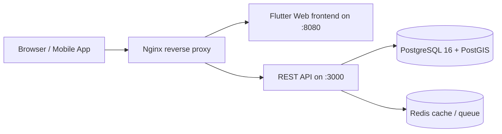

# Slökun DevOps & Infrastructure

This repository contains the shared local Docker stack, CI/CD configuration, and Hetzner provisioning guidance for the Slökun platform.

MVP scope is intentionally limited to local Docker Compose orchestration and CI/CD automation. Live Hetzner deployment is prepared as a later step once the backend and frontend repositories are ready for production.

## Architecture



## Local development

1. Copy the example environment file:

```bash
cp .env.example .env
```

2. Start the full stack:

```bash
docker compose up --build
```

3. The stack exposes:

- Frontend: http://localhost:8080
- Backend API: http://localhost:3000
- Nginx proxy: http://localhost
- PostgreSQL: localhost:5432
- Redis: localhost:6379

4. Check health:

```bash
curl http://localhost/health
curl http://localhost:3000/health
```

5. Stop the stack:

```bash
docker compose down -v
```

## Service contract

The shared stack was designed against the current frontend/backend sessions:

- Backend: NestJS service, port 3000, health endpoint `GET /health`
- Frontend: Flutter Web app, port 8080, served via web server or static assets
- Nginx: proxies `/api/*` to the backend and all other traffic to the frontend
- PostgreSQL: PostGIS-enabled database on `db:5432`
- Redis: in-memory cache and queue backend on `redis:6379`

## Database bootstrapping

The database image automatically runs the scripts in `docker/postgres/initdb/` during initialization. Flyway migrations are executed via the `flyway` service defined in `docker-compose.yml` using versioned SQL under `docker/postgres/migrations/`.

Example migration flow:

```bash
docker compose up -d db redis

docker compose run --rm flyway
```

Backup command:

```bash
chmod +x scripts/backup-postgres.sh
./scripts/backup-postgres.sh
```

## Environment variables

See `.env.example` for the complete set of required and optional variables. At minimum:

```env
POSTGRES_DB=slokun
POSTGRES_USER=slokun
POSTGRES_PASSWORD=slokun
JWT_SECRET=replace-me
FRONTEND_URL=http://localhost
API_BASE_URL=http://localhost/api
```

## CI/CD

The workflow in `.github/workflows/ci.yml` validates the Docker Compose stack and checks the backend/frontend repositories for tests and production builds.

The pipeline includes:

- backend dependency install + build + optional test
- frontend Flutter web install + test + build
- Docker image build/publish to GitHub Container Registry on main branch pushes
- compose validation step

## Hetzner preparation

The repo includes a provisioning helper at `scripts/provision-hetzner.sh` for creating a Hetzner Cloud server and installing the required SSH key.

Typical flow:

```bash
export HCLOUD_TOKEN=... 
./scripts/provision-hetzner.sh
```

Additional deployment preparation:

- NGINX reverse proxy config: `infrastructure/hetzner/nginx-ssl.conf`
- SSL certificate instructions: `certbot --nginx -d api.slokun.eu -d business.slokun.eu`
- Domain routing: `api.slokun.eu -> backend`, `business.slokun.eu -> frontend`
- Firewall: open ports 22, 80, and 443

## Notes

- `docker compose up` is the primary local validation command for MVP.
- The backend and frontend repositories are expected to live alongside this one in sibling directories at `../slokun-backend` and `../slokun-frontend`.
- The production deployment stage is intentionally deferred until the application itself is ready to run on Hetzner.
